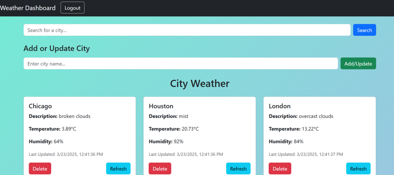

# 🌦 Weather Dashboard App

This is a **Full-Stack Weather Application** built with:
- 🌐 **Frontend:** React.js (client)
- ⚙️ **Backend:** .NET 8 Web API with SQLite
- 🐳 **Docker** for containerization

---

## 📌 Features
- **Search:** Find weather data for a specific city.
- **Add/Update:** Add a new city or update existing city weather data.
- **Delete:** Remove a city from the dashboard.
- **Refresh:** Fetch the latest weather data for a city.
- **Logout:** Securely log out of the application.
- 🚀 Deployable using Docker and Docker Compose

---

## 🚀 **How to Run Locally (Without Docker)**

### ✅ **1. Prerequisites**
Ensure you have:
- **Node.js + NPM** installed → [Download Node.js](https://nodejs.org)
- **.NET SDK 8.0+** installed → [Download .NET 8](https://dotnet.microsoft.com/en-us/download)
- **SQLite** installed (or use the provided `weather.db`)

### ✅ **2. Clone the Repository**
```bash
git clone https://github.com/MadhanKumarSundaresan/WeatherApp.git
cd weatherApp
```

## 🐳 **Run with Docker**
You can containerize the entire application using Docker.

### ✅ **1. Install Docker**
- Download and install **Docker** → [Docker Official Site](https://www.docker.com/)

### ✅ **2. Build and Run with Docker Compose**
```bash
docker-compose up --build
```
- **Frontend:** `http://localhost:3000`  
- **Backend API:** `http://localhost:5102`  

### ✅ **3. Stop the Containers**
```bash
docker-compose down
```

---

## 🛠️ How to Use

### **1. Search for a City**
- Use the **Search for a city...** textbox at the top.
- Click the blue **Search** button.
- The dashboard will display the matching city’s weather data.

### **2. Add or Update a City**
- Enter the city name in the **Add or Update City** section.
- Click the green **Add/Update** button.
- If the city already exists, the weather data will be updated.
- If the city is new, it will be added to the list.

### **3. Delete a City**
- Each weather card has a red **Delete** button.
- Click **Delete** to remove the city from the dashboard.
- This action is permanent.

### **4. Refresh Weather Data**
- Each city card has a blue **Refresh** button.
- Click **Refresh** to fetch the latest weather data for that city.

### **5. Logout**
- Click the **Logout** button in the top-right corner.
- You will be securely logged out and redirected.

---

## 📸 Screenshot



---
## 🔥 **Environment Variables(OPTIONAL)**
The application supports environment variables for customization.

| Variable                  | Description                  | Default Value           |
|---------------------------|------------------------------|-------------------------|
| `ASPNETCORE_ENVIRONMENT`  | API environment mode         | Development             |
| `ASPNETCORE_URLS`         | URL where the API runs       | `http://+:5102`         |
| `REACT_APP_API_URL`       | Frontend API URL             | `http://localhost:5102` |

---

## 🎯 **Project Structure**
```
📂 WeatherApp
 ┣ 📂 client              # React frontend
 ┣ 📂 server              # .NET Core backend
 ┣ 📜 docker-compose.yml  # Docker Compose file
 ┣ 📜 SERVER/Dockerfile          # Backend Docker config
 ┣ 📜 README.md           # Documentation
 ┗ 📜 weather.db          # SQLite database file(Due to some issues in EF with docker, commited the db file)
```

---

## 🛠 **Troubleshooting**
### ❌ Port Already in Use?
```bash
netstat -ano | findstr :5102
```
Kill the process using:
```bash
taskkill /PID <pid> /F
```

### ❌ Error: `No .NET SDKs were found`
Ensure **.NET SDK 8+** is installed.

### ❌ Database Not Updating in Docker?
Run migrations manually inside the container:
```bash
docker exec -it weather-api-server-1 dotnet ef database update
```

---

## 📜 **License**
MIT License.

---

## 🤝 **Contributing**
Pull requests are welcome! For major changes, open an issue first.

---

## ✨ **Author**
Developed by **Madhan Kumar S**.
# WeatherApp